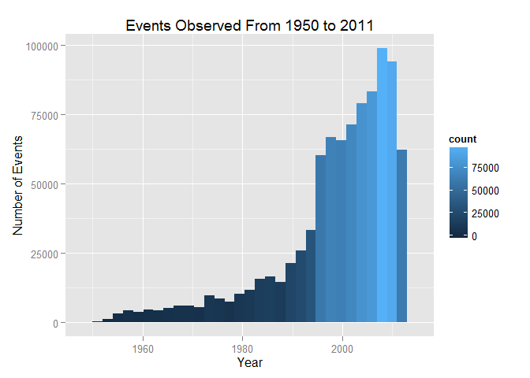
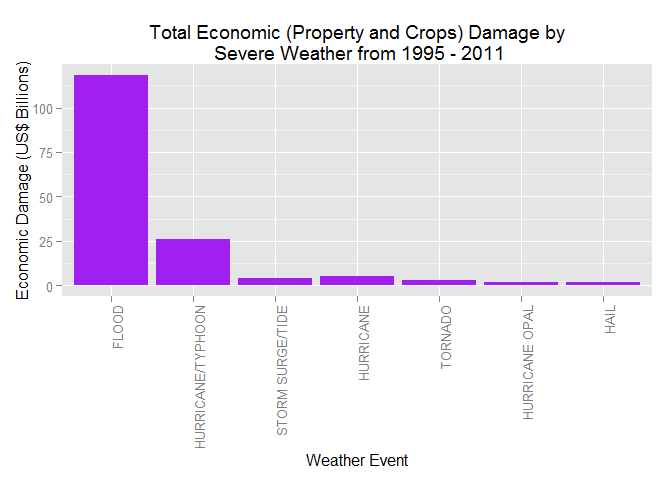

# Assignment2
Yago Gonzalez  
Monday, November 16, 2015  


# Weather Impact on US Population Health and the Economy - A Study from 1995 to 2011


It is no surprise that the weather has a deep impact on a population's health and that the damage of severe
weather can be catastrophic for the economy of a region affected by such weather.  What is less clear is what type of weather event has the largest impact on health and the economy.  In this study we attempt to answer such questions by analyzing data from the U.S. National Oceanic and Atmospheric Administration's (NOAA) storm [database](https://d396qusza40orc.cloudfront.net/repdata%2Fdata%2FStormData.csv.bz2) spanning the periods from 1995 to 2011.  In conclusion we find that Tornadoes are the most dangerous weather events for the US Population and that Floods are the most damaging weather event to the US economy

## Data Processing 

**1\. Read the data**

>The data file should be loaded into the working directory.

```r
data<-read.csv("C:/Users/Yago/Documents/Statistical Studies/The Data Science Track/Reproducible Research/Assignment 2/repdata-data-StormData.csv.bz2")
```

**2\. Set the global environment**

>Load the required R packages

>Set the scientific notation

```r
library("dplyr")
library ("ggplot2")
library("gridExtra")
options(scipen=999)
```

**3\. Transform date**

```r
data$BGN_DATE<-as.numeric(format(as.Date(data$BGN_DATE, format = "%m/%d/%Y %H:%M:%S"), "%Y"))
```

**4\. Transform Property multiplier**

```r
data$propMult[data$PROPDMGEXP == "K"] <- 1000
data$propMult[data$PROPDMGEXP == "M"] <- 1000000
data$propMult[data$PROPDMGEXP == ""] <- 1
data$propMult[data$PROPDMGEXP == "B"] <- 1000000000
data$propMult[data$PROPDMGEXP == "m"] <- 1000000
data$propMult[data$PROPDMGEXP == "0"] <- 1
data$propMult[data$PROPDMGEXP == "5"] <- 100000
data$propMult[data$PROPDMGEXP == "6"] <- 1000000
data$propMult[data$PROPDMGEXP == "4"] <- 10000
data$propMult[data$PROPDMGEXP == "2"] <- 100
data$propMult[data$PROPDMGEXP == "3"] <- 1000
data$propMult[data$PROPDMGEXP == "h"] <- 100
data$propMult[data$PROPDMGEXP == "7"] <- 10000000
data$propMult[data$PROPDMGEXP == "H"] <- 100
data$propMult[data$PROPDMGEXP == "1"] <- 10
data$propMult[data$PROPDMGEXP == "8"] <- 100000000
data$propMult[data$PROPDMGEXP == "+"] <- 0
data$propMult[data$PROPDMGEXP == "-"] <- 0
data$propMult[data$PROPDMGEXP == "?"] <- 0

data$newPROPDMG<-data$PROPDMG * data$propMult
```

**5\. Transform Crop multiplier**

```r
data$cropMult[data$CROPDMGEXP == "M"] <- 1000000
data$cropMult[data$CROPDMGEXP == "K"] <- 1000
data$cropMult[data$CROPDMGEXP == "m"] <- 1000000
data$cropMult[data$CROPDMGEXP == "B"] <- 1000000000
data$cropMult[data$CROPDMGEXP == "?"] <- 0
data$cropMult[data$CROPDMGEXP == "0"] <- 0
data$cropMult[data$CROPDMGEXP == "k"] <- 1000
data$cropMult[data$CROPDMGEXP == "2"] <- 100

data$newCROPDMG<-data$CROPDMG * data$cropMult

data$newDMG<-(data$newPROPDMG + data$newCROPDMG)/1000000000
```

**6\. Analyze collection of events**

>As we can see in the Chart below by the change of color pattern in the bars from dark to light, 
the collection of events increased dramatically around the year 1995.  In order to prevent skewing the results we will conduct our analysis using data starting in 1995.


```r
ggplot(data, aes(BGN_DATE))+
     geom_histogram(aes(fill=..count..))+
     labs(title=("Events Observed From 1950 to 2011"))+
     labs(x="Year", y="Number of Events")
```

 

>Because of this observation we will slice our database to include only observations ranging from the 
1995 to 2011 periods.

```r
highData<-data[data$BGN_DATE>=1995,]
```

##Results

**1\. Weather Impact on US Population Health**

>We will take a look at Fatalities and Injuries separately.  
>We will focus on the top 15 events for each category


```r
deaths <- aggregate(FATALITIES ~ EVTYPE, highData, sum)
deaths <- deaths[order(-deaths$FATALITIES), ][1:15, ]
deaths <- within(deaths, EVTYPE <- factor(x = EVTYPE, levels = deaths$EVTYPE))
 
injuries <- aggregate(INJURIES ~ EVTYPE, highData, sum)
injuries <- injuries[order(-injuries$INJURIES), ][1:15, ]
injuries <- within(injuries, EVTYPE <- factor(x = EVTYPE, levels = injuries$EVTYPE))

plotFatalities<-qplot(EVTYPE, data=deaths, weight=FATALITIES,
     geom="bar", binwidth=1)+
     geom_bar(fill="lightgreen")+
     scale_y_continuous("FATALITIES") + 
     theme(axis.text.x = element_text(angle = 90, 
                                      hjust = 1)) + xlab("Weather Event") +
     ggtitle("Total FATALITIES by Severe Weather\n from 1995 - 2011")

plotInjuries<-qplot(EVTYPE, data=injuries, weight=INJURIES,
      geom="bar", binwidth=1)+
     geom_bar(fill="lightblue")+
     scale_y_continuous("INJURIES") + 
     theme(axis.text.x = element_text(angle = 90, 
                                      hjust = 1)) + xlab("Weather Event") +
     ggtitle("Total INJURIES by Severe Weather\n from 1995 - 2011")

grid.arrange(plotFatalities, plotInjuries, ncol = 2)
```

 

>>As we can see from the charts above **Excessive Heat, Tornados and Floods** are the most dangerous weather events for the US Population.  Out of these three, **Tornados** are particulary dangerous as they account for the largest number of injuries and represent a large portion of fatalities during the studied period. 

**2\. Weather Impact on the US Economy**

>We will aggregate the data for property and crops in order to get a sense of total economic damage.  


```r
ecoDamage <- highData[order(-highData$newDMG),][1:15, ]
ecoDamage <- within(ecoDamage, EVTYPE <- factor(x = EVTYPE, levels = ecoDamage$EVTYPE))

##Plot Economic Damage
qplot(EVTYPE, data=ecoDamage, weight=newDMG,
                    geom="bar", binwidth=1)+
     geom_bar(fill="purple")+
     scale_y_continuous("Economic Damage (US$ Billions)") + 
     theme(axis.text.x = element_text(angle = 90, 
                                      hjust = 1)) + xlab("Weather Event") +
     ggtitle("Total Economic (Property and Crops) Damage by\n Severe Weather from 1995 - 2011")
```

 

>>The chart above shows that **Floods** are, by far, the most damaging weather event to the US economy accounting for more than $100 billion in damages during the period studied.  That amount is 4 times higher than the impact of the second most damaging event **-Hurricane/Typhoon-**.
